# From Enterprise Copilot to an Agentic Operating System

> **A CTO briefing inspired by JPMorganChase’s public AI trajectory**  
> How a governed platform combining foundation models, retrieval, tools, identity, policy, and observability can evolve from a secure assistant into an enterprise execution layer.

---

<div style="text-align:center; padding: 2.4rem 1rem; margin: 1rem 0 2rem; border-radius: 18px; background: linear-gradient(135deg,#07111f 0%,#102a43 48%,#0b7285 100%); color:white;">
  <div style="font-size:.82rem; letter-spacing:.16em; text-transform:uppercase; opacity:.8;">Strategic Architecture Brief</div>
  <div style="font-size:2.25rem; font-weight:750; line-height:1.15; margin:.55rem 0;">The Enterprise AI Control Plane</div>
  <div style="max-width:780px; margin:auto; font-size:1.05rem; opacity:.92;">
    One governed intelligence layer. Many specialized agents. Secure access to institutional knowledge and operational systems.
  </div>
</div>

## Executive perspective

JPMorganChase’s public AI program is instructive because it is not framed as a collection of isolated chatbots. The firm has built **LLM Suite**, its proprietary generative-AI platform, expanded access to approximately **200,000 employees**, and publicly described work on AI agents, hybrid reasoning, planning, knowledge management, and multi-step automation. Its 2025 annual-report material also identifies a personalized **Employee Assistant** intended to provide a single place where employees can obtain help and take action across the firm.

The strategic lesson is not to reproduce a specific JPMorgan implementation—its internal architecture is not publicly documented in sufficient detail. The lesson is to adopt the same direction:

> **Build a governed enterprise AI platform first; place specialized assistants and agents on top of it; connect knowledge and systems through controlled interfaces; preserve human authority over consequential actions.**

This document separates two things:

- **Publicly established JPMorganChase direction:** LLM Suite, broad workforce adoption, AI-assisted engineering, AI-agent research, and the Employee Assistant.
- **Proposed reference architecture:** an implementation pattern using RAG, MCP-compatible tool adapters, identity-aware authorization, workflow orchestration, policy enforcement, and end-to-end observability.

---

## 1. The strategic shift

Traditional enterprise software requires the user to understand the application, locate the right screen, interpret the data, and manually coordinate each subsequent step. An agentic platform reverses this relationship: the user states an objective, while the system locates information, invokes approved capabilities, asks for authorization when required, and presents an auditable result.

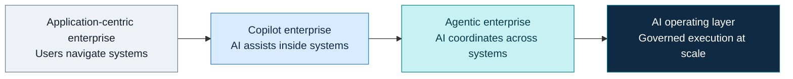

The progression is architectural:

| Stage | Primary capability | Organizational effect |
|---|---|---|
| Search and chat | Retrieve and summarize information | Reduces time spent finding knowledge |
| Copilot | Assist within a defined application | Accelerates individual tasks |
| Agent | Plan and execute a bounded workflow | Compresses multi-system processes |
| Agentic platform | Govern many agents and tools | Creates a reusable enterprise capability |

---

## 2. What JPMorganChase has publicly established

JPMorganChase describes LLM Suite as a proprietary generative-AI platform and internal chatbot. Public material states that access expanded to roughly 200,000 employees after its 2024 launch. The firm’s AI research agenda explicitly includes **AI Agents & Hybrid Reasoning**, with an emphasis on multi-step and multi-agent tasks, computer-use actions, asking humans for help, and learning from human input.

The company has also reported large-scale AI adoption in engineering and business functions. Its 2025 shareholder material states that more than 90% of engineers use AI coding assistants and that over 65,000 Corporate and Investment Bank colleagues actively use LLM Suite. In 2026, the firm described an Employee Assistant intended to provide personalized help and enable action across the organization.

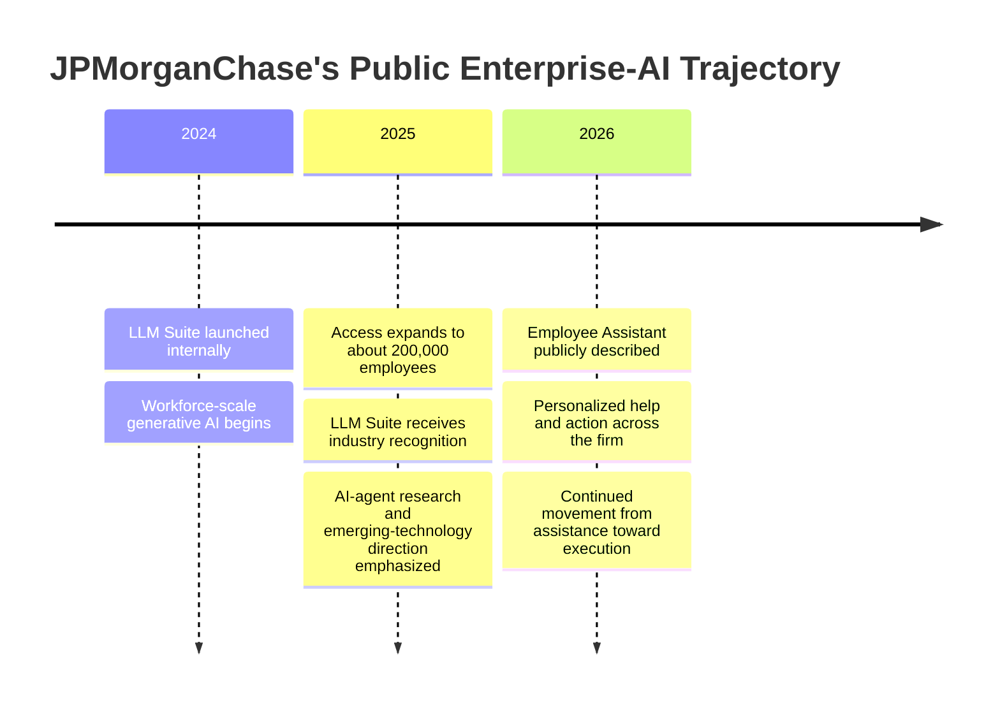

### What should not be inferred

JPMorganChase has **not publicly confirmed** that LLM Suite is implemented with Model Context Protocol, a particular vector database, a particular agent framework, or the exact topology shown in this document. The diagrams that follow are a reference design derived from public direction and current enterprise architecture patterns.

---

## 3. The central design idea

The platform should not be “one giant autonomous agent.” It should be a **control plane** that coordinates bounded, role-specific agents under a common security and governance model.

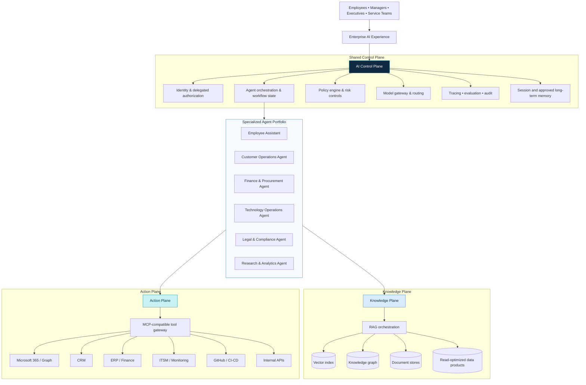

This design yields five separations that matter operationally:

1. **Reasoning is separated from authority.** The model may recommend or plan an action; the policy layer determines whether it is permitted.
2. **Knowledge access is separated from system mutation.** RAG retrieves context. Tools execute operations.
3. **Agents are separated from integrations.** Multiple agents reuse the same governed tool adapters.
4. **Model choice is separated from application logic.** A model gateway permits routing, replacement, fallback, and cost control.
5. **User experience is separated from backend systems.** The assistant becomes a unified interaction layer without becoming a shadow system of record.

---

## 4. RAG and MCP solve different problems

RAG and MCP are complementary, not competing, technologies.

**Retrieval-Augmented Generation (RAG)** grounds a model in enterprise information. It retrieves relevant content—policies, manuals, tickets, reports, contracts, records, or approved data products—and supplies that evidence to the model.

**Model Context Protocol (MCP)** is an open standard for connecting AI applications to tools, data sources, and workflows. In an enterprise design, MCP can serve as a consistent interface over approved capabilities, although existing REST, GraphQL, event, database, and service interfaces may remain underneath it.

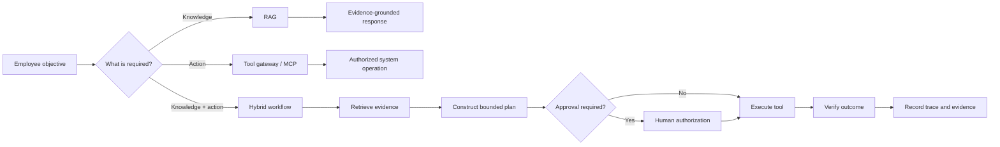

### A useful mental model

> **RAG gives the agent institutional knowledge. MCP-compatible tools give it hands. Identity and policy determine what those hands are allowed to touch. Observability records what happened.**

RAG alone produces an informed conversational system. Tool access alone produces a potentially dangerous automation surface. The enterprise system emerges only when knowledge, action, authority, and evidence are integrated.

---

## 5. A representative executive workflow

Consider a CTO asking:

> “Assess yesterday’s priority incidents, identify recurring causes, compare them with current change activity, and prepare an executive brief with recommended actions.”

A robust agent does not send the entire request to a single prompt and hope for a correct answer. It constructs and executes a stateful plan.

```mermaid
sequenceDiagram
    autonumber
    actor CTO
    participant UI as Enterprise Assistant
    participant OR as Orchestrator
    participant R as RAG Service
    participant TG as Tool Gateway
    participant SYS as Enterprise Systems
    participant PE as Policy Engine
    participant EV as Evaluation & Audit

    CTO->>UI: Assess incidents and prepare an executive brief
    UI->>OR: Create task with user identity and scope
    OR->>PE: Resolve permissions and risk class
    PE-->>OR: Read access approved; write actions require confirmation

    OR->>TG: Query incident, monitoring, and change systems
    TG->>SYS: Execute identity-scoped read operations
    SYS-->>TG: Incidents, metrics, deployments, changes
    TG-->>OR: Normalized structured results

    OR->>R: Retrieve runbooks, postmortems, architecture notes, policies
    R-->>OR: Ranked evidence with provenance

    OR->>OR: Correlate events, test hypotheses, quantify confidence
    OR->>EV: Run factuality, citation, and policy checks
    EV-->>OR: Pass with two low-confidence findings flagged

    OR->>UI: Present brief, evidence, uncertainty, and recommended actions
    UI-->>CTO: Executive analysis with drill-down trace

    CTO->>UI: Create remediation tasks
    UI->>PE: Request write authorization
    PE-->>UI: Require explicit confirmation
    CTO->>UI: Confirm
    UI->>TG: Create approved tasks
    TG->>SYS: Write to ITSM
    SYS-->>TG: Task identifiers and status
    TG-->>UI: Verified completion
```

The crucial property is not “autonomy.” It is **controlled delegation**.

---

## 6. The enterprise agent lifecycle

Each agent execution should behave like a transaction with explicit phases.

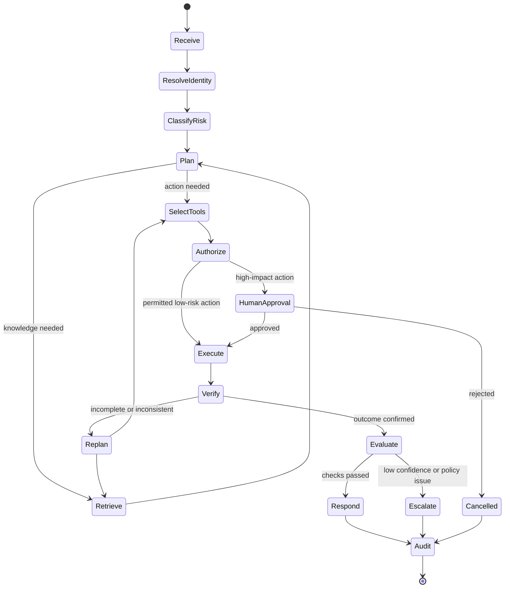

This lifecycle supports retry, recovery, human escalation, and forensic reconstruction. Without state, an agent is merely a sequence of loosely connected model calls.

---

## 7. Governance is part of the runtime

A financial institution cannot treat governance as a document reviewed after deployment. Governance must be executable.

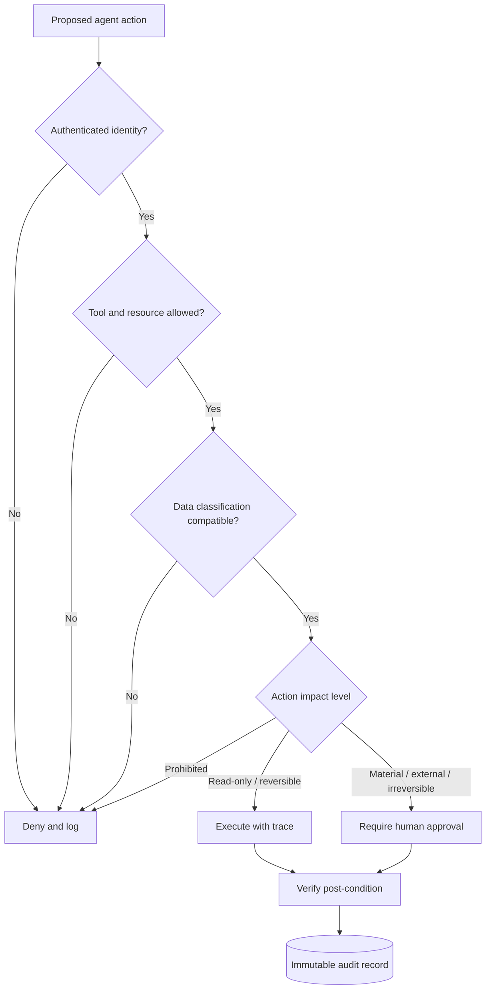

The policy engine should evaluate at least:

- authenticated user and delegated identity;
- agent identity and deployment version;
- tool, operation, resource, and data classification;
- least-privilege scope and purpose limitation;
- action reversibility and financial or operational impact;
- segregation-of-duties constraints;
- required approval tier;
- retention, residency, and disclosure requirements;
- prompt-injection and data-exfiltration risk;
- post-condition verification.

An agent must never receive broader authority merely because its natural-language interface appears convenient.

---

## 8. Defense against prompt injection and tool misuse

Once an LLM can call tools, untrusted content can become an instruction-delivery mechanism. Documents, emails, webpages, tickets, and retrieved text must therefore be treated as **data**, not authority.

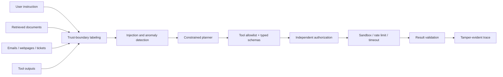

The minimum control set is:

- explicit trust labels on every context source;
- separation between instructions and retrieved content;
- typed tool schemas rather than free-form command generation;
- operation-specific authorization independent of model reasoning;
- allowlists, timeouts, quotas, and network restrictions;
- content sanitization and secret redaction;
- confirmation for irreversible or externally visible actions;
- result validation against expected post-conditions;
- continuous adversarial evaluation.

---

## 9. Multi-agent design: use specialization carefully

Specialized agents are valuable where domains have distinct policies, tools, vocabularies, and evaluation criteria. They are not automatically superior to a single well-designed orchestrator.

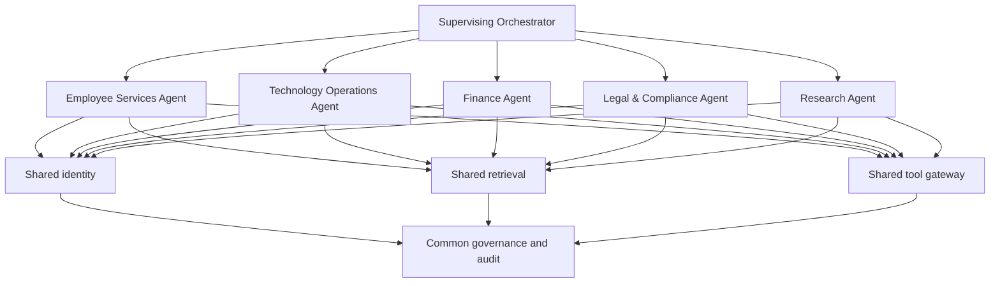

Create a separate agent only when at least one boundary is real:

- a materially different authorization model;
- a separate business owner and risk owner;
- specialized tools or data;
- a distinct evaluation suite;
- a distinct operational SLO;
- a need for independent deployment and rollback.

Otherwise, “multi-agent” can become unnecessary latency, cost, and failure surface.

---

## 10. The platform data model

The platform needs more than a vector database. It needs several memory and evidence layers with different semantics.

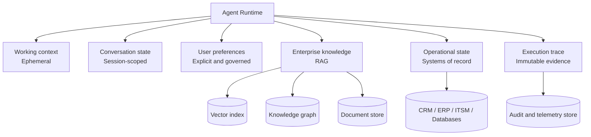

These stores should not be conflated. A conversation summary is not an authoritative customer record. A vector index is not a system of record. Agent memory must not silently become policy.

---

## 11. Model strategy: routing rather than dependence

An enterprise control plane should support multiple models and assign them according to task requirements.

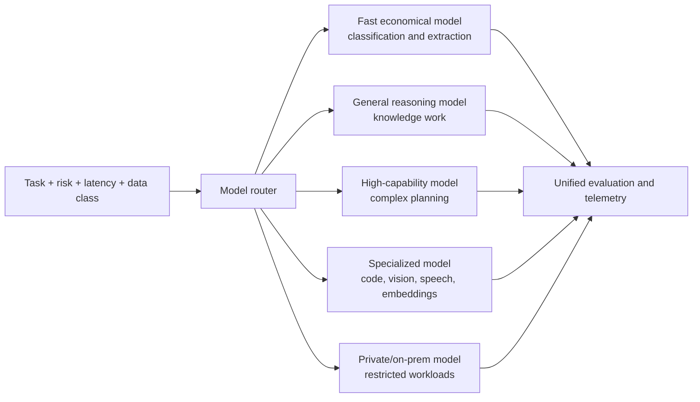

Routing criteria should include quality, latency, cost, context length, tool-use reliability, regional availability, data handling, and task-specific evaluation scores. Model substitution should be possible without rewriting the business workflow.

---

## 12. Observability: every answer becomes an inspectable execution

Conventional application monitoring is insufficient. Agent observability must reconstruct the reasoning environment without indiscriminately exposing sensitive content.

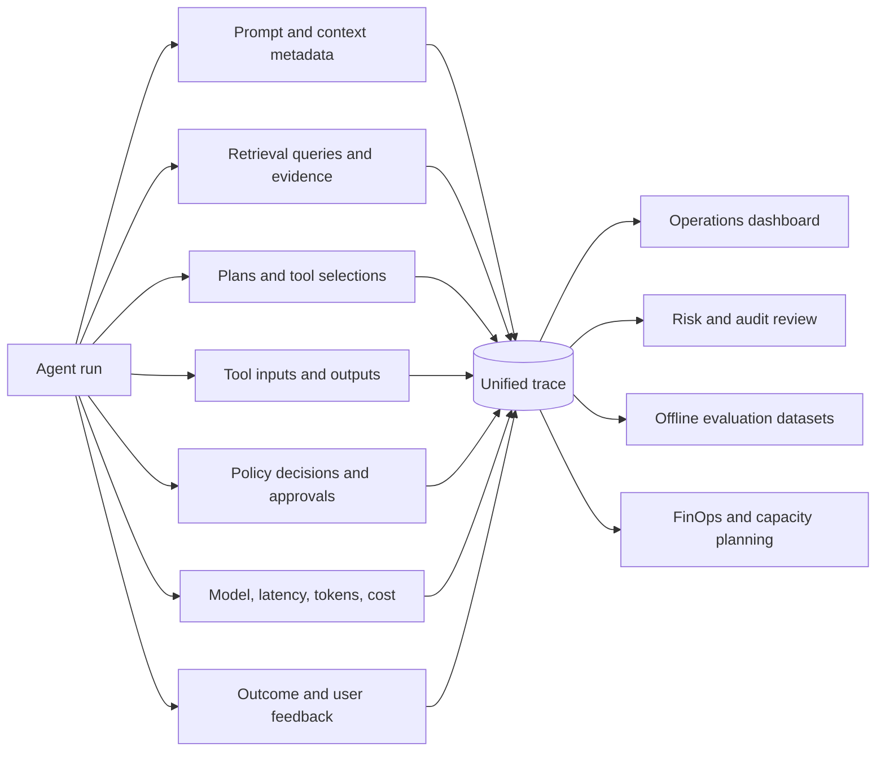

The target is not surveillance. It is reproducibility, operational control, and accountable automation.

---

## 13. Evaluation architecture

A model benchmark is only one layer. The unit under evaluation is the **complete workflow**.

| Layer | Example measures |
|---|---|
| Retrieval | recall, precision, freshness, access-control correctness |
| Generation | factuality, citation fidelity, completeness, uncertainty calibration |
| Planning | task decomposition, redundant steps, recovery behavior |
| Tool use | correct tool, valid arguments, execution success, side-effect accuracy |
| Security | injection resistance, data leakage, privilege escalation |
| Business outcome | cycle time, resolution rate, rework, user acceptance |
| Operations | latency, availability, token cost, tool cost, failure rate |
| Governance | approval compliance, audit completeness, policy violations |

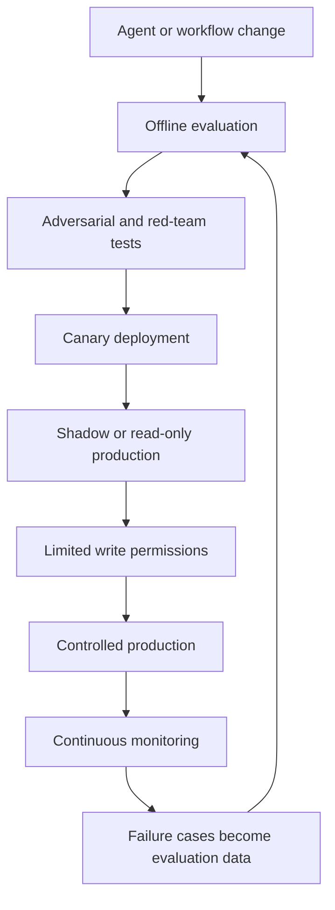

Promotion should be evidence-based. A compelling demonstration is not a production readiness criterion.

---

## 14. Recommended implementation roadmap

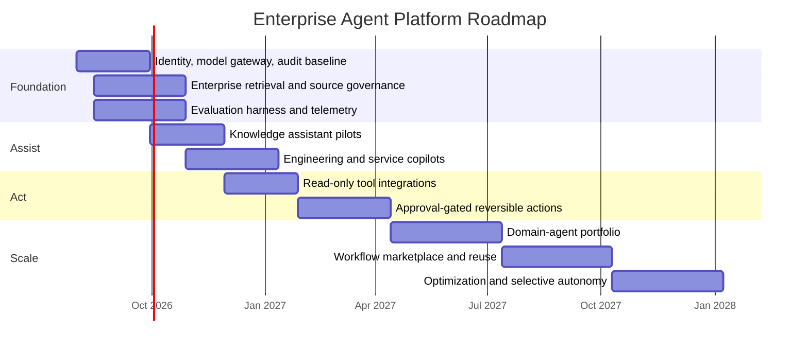

### Phase 1 — Establish the control plane

Build identity propagation, a model gateway, retrieval governance, a tool registry, trace infrastructure, and evaluation pipelines. Do not begin with dozens of agents.

### Phase 2 — Deploy high-value read-oriented assistants

Prioritize knowledge-intensive workloads where value is measurable and operational risk is limited: policy assistance, technical support, research synthesis, engineering knowledge, incident analysis, and document intelligence.

### Phase 3 — Add bounded actions

Expose read-only tools first. Then add reversible, low-impact writes with explicit confirmation. Introduce approval gates for material operations.

### Phase 4 — Build domain agents

Create specialized agents only where ownership, data, authorization, and evaluation genuinely differ. Reuse the common platform.

### Phase 5 — Optimize autonomy selectively

Expand autonomous execution only where historical traces demonstrate high reliability, failures are detectable, and recovery is safe.

---

## 15. CTO decision framework

The architecture should be approved only if the organization can answer these questions precisely:

| Question | Required answer |
|---|---|
| Who is acting? | Authenticated human identity plus explicit agent identity |
| Under whose authority? | Delegated, least-privilege, time-bounded authorization |
| What knowledge was used? | Source-level provenance with access checks |
| Which model decided? | Model, version, configuration, and routing rationale |
| Which tools were called? | Typed operations, parameters, responses, and effects |
| Why was the action allowed? | Recorded policy decision and approval evidence |
| Did the action succeed? | Verified post-condition, not merely a successful API response |
| Can it be reversed? | Defined compensation or rollback procedure |
| How is quality measured? | Workflow-specific evaluation and business KPIs |
| What happens when confidence is low? | Escalation, abstention, or human review |

---

## 16. Strategic implications

A JPMorgan-inspired program suggests several principles for an enterprise pursuing a similar transformation.

### Platform before proliferation

The compounding asset is not a chatbot. It is the shared control plane: identity, retrieval, model routing, tools, workflow state, policy, telemetry, and evaluation. Every new agent should inherit these capabilities.

### Controlled agency before autonomy

The near-term objective should be reliable delegation under explicit boundaries, not unrestricted autonomous behavior. The most valuable workflows are often partially automated and tightly governed.

### Integration reuse before bespoke connectors

A standardized tool layer—potentially MCP-compatible—reduces repeated integration work. However, protocol uniformity does not replace API governance, semantic consistency, or authorization design.

### Evidence before eloquence

Enterprise trust depends on provenance, verifiability, and outcome accuracy. A fluent answer without inspectable evidence is insufficient.

### Business workflows before generic chat

The highest value comes from reducing complete cycle times: incident-to-remediation, request-to-approval, inquiry-to-resolution, analysis-to-decision—not merely shortening document drafting.

---

## 17. The target operating model

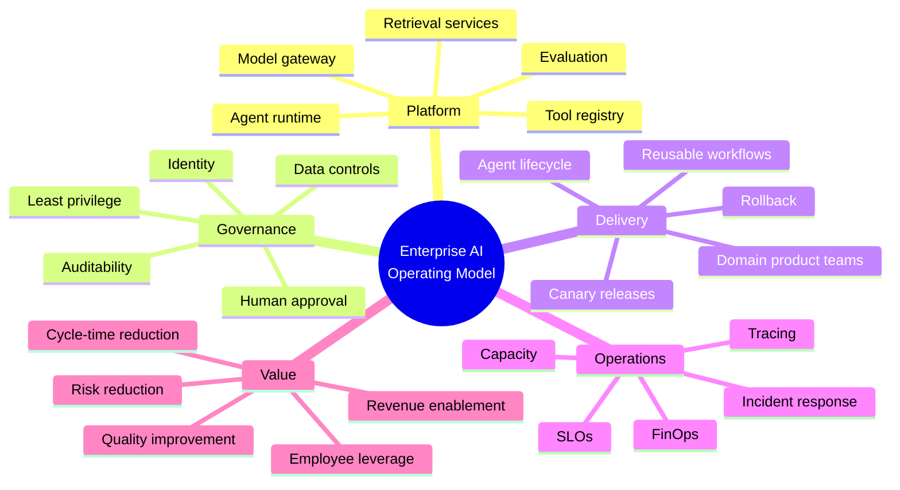

The organizational model should pair a central platform team with domain-owned agent products:

- The **platform team** owns runtime, security primitives, model access, retrieval, tools, observability, and evaluation infrastructure.
- **Domain teams** own workflows, business semantics, acceptance criteria, and operational outcomes.
- **Risk, security, legal, and compliance** define executable policies and approval classes.
- A cross-functional **AI governance council** governs standards and exceptional-risk use cases without becoming a manual bottleneck for every iteration.

---

## 18. Final architecture thesis

<div style="padding:1.4rem 1.6rem; margin:1.5rem 0; border-left:6px solid #0b7285; border-radius:10px; background:#eefafa;">
  <strong>The winning enterprise design is neither a single chatbot nor a collection of disconnected agents.</strong><br><br>
  It is a governed intelligence and execution layer that can understand an objective, retrieve authorized evidence, construct a bounded plan, invoke approved tools, request human authority at the correct boundary, verify the result, and preserve a complete audit trail.
</div>

JPMorganChase’s public trajectory—from LLM Suite to workforce-scale adoption, AI-agent research, and a personalized Employee Assistant—illustrates the direction. RAG can provide institutional memory. MCP-compatible integrations can provide a reusable action interface. Neither is sufficient alone. The decisive capability is the **control plane that binds models, knowledge, tools, identity, policy, evaluation, and operations into one coherent system**.

That is the transition from enterprise copilot to enterprise AI operating system.

---

## Public sources

1. [JPMorganChase — LLM Suite named 2025 “Innovation of the Year”](https://www.jpmorganchase.com/about/technology/blog/llmsuite-ab-award)
2. [JPMorganChase — Innovation Week 2025: LLM Suite adoption](https://www.jpmorganchase.com/about/technology/blog/innovation-week25)
3. [JPMorganChase — Artificial Intelligence Research](https://www.jpmorganchase.com/about/technology/research/ai)
4. [JPMorganChase — 2025 Annual Report: Letter from Jennifer A. Piepszak](https://www.jpmorganchase.com/ir/annual-report/2025/ar-ceo-letter-jennifer-piepszak)
5. [JPMorganChase — 2025 Line-of-Business CEO Letters](https://www.jpmorganchase.com/content/dam/jpmc/jpmorgan-chase-and-co/investor-relations/documents/line-of-business-ceo-letters-to-shareholders-2025.pdf)
6. [JPMorganChase — Emerging Technology Trends 2025](https://www.jpmorgan.com/content/dam/jpmorgan/documents/technology/jpmc-emerging-technology-trends-report.pdf)
7. [Anthropic — Model Context Protocol](https://docs.anthropic.com/en/docs/agents-and-tools/mcp)
8. [Microsoft — MCP Server for Enterprise overview](https://learn.microsoft.com/en-us/graph/mcp-server/overview)
9. [Docsify-This — Markdown publishing platform](https://docsify-this.net/)

---

<small>
<strong>Research note:</strong> Public sources were reviewed through 16 July 2026. Internal JPMorganChase implementation details are proprietary. Any reference to MCP, RAG topology, vector databases, knowledge graphs, model routing, or specific control-plane components is presented as a proposed enterprise reference architecture—not as a factual description of JPMorganChase’s undisclosed internal stack.
</small>
