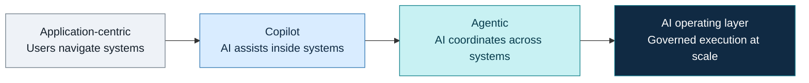
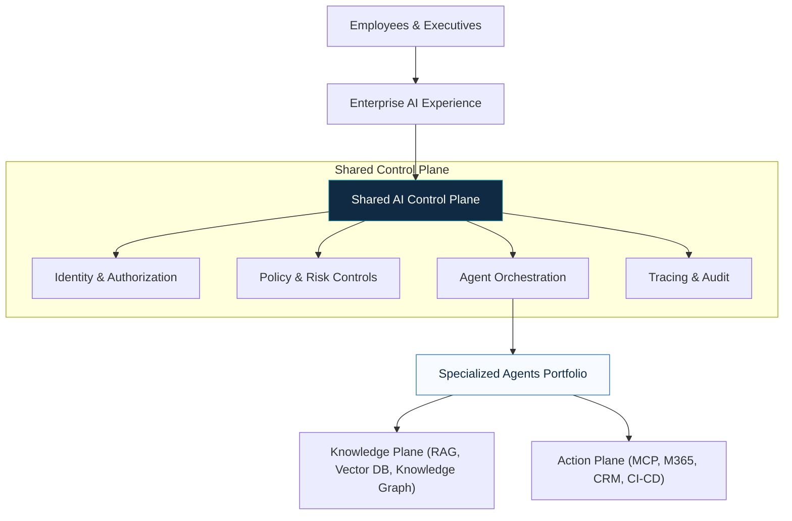
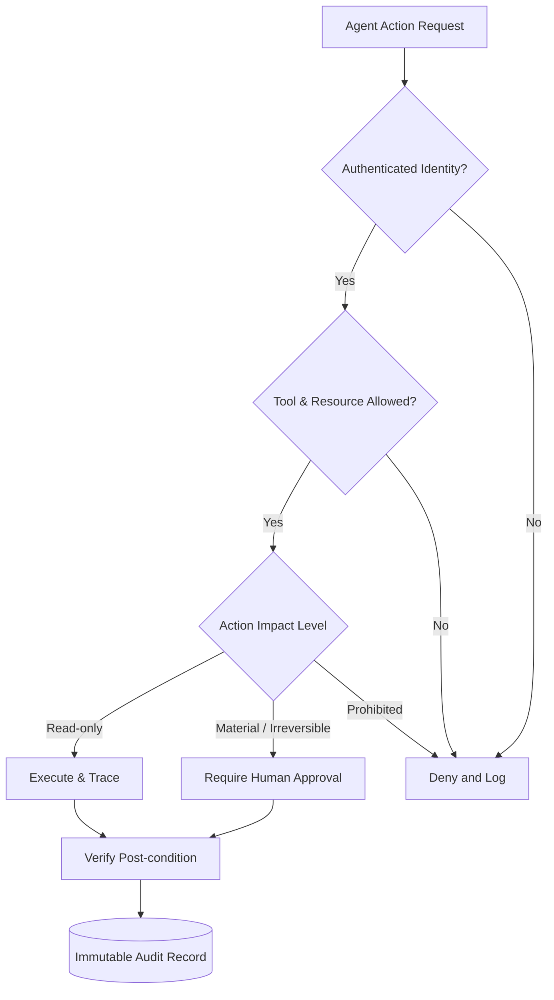
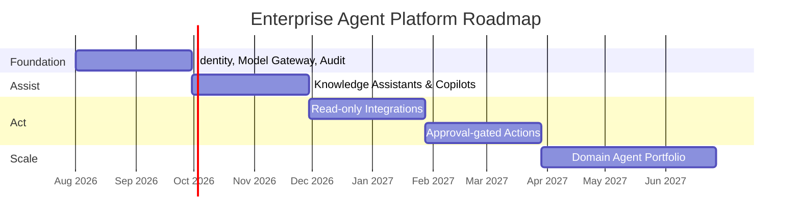

# From Enterprise Copilot to an Agentic Operating System

> **A CTO briefing inspired by JPMorganChase’s public AI trajectory**  
> How a governed platform combining foundation models, retrieval, tools, identity, policy, and observability can evolve from a secure assistant into an enterprise execution layer.

---

  
Strategic Architecture Brief

  
The Enterprise AI Control Plane

  

    One governed intelligence layer. Many specialized agents. Secure access to institutional knowledge and operational systems.
  

## Table of Contents

| Section | Description |
|---|---|
| [1. Executive Summary & Strategic Shift](#1-executive-summary--strategic-shift) | The transition from isolated assistants to a governed enterprise execution platform. |
| [2. The AI Control Plane Architecture](#2-the-ai-control-plane-architecture) | The core reference design separating reasoning, authority, knowledge, and integration. |
| [3. Governance, Security & Trust](#3-governance-security--trust) | Executable policies, identity management, and defense against prompt injection. |
| [4. Observability & Evaluation](#4-observability--evaluation) | Agent lifecycle tracing, outcome verification, and workflow-based evaluation. |
| [5. Implementation Roadmap](#5-implementation-roadmap) | A phased approach to scaling from foundation to domain-specific agent autonomy. |
| [6. CTO Decision Framework](#6-cto-decision-framework) | Essential operational questions to validate security, authority, and accountability. |

---

## 1. Executive Summary & Strategic Shift

The strategic lesson from enterprise AI trajectories is not to deploy a collection of isolated chatbots, but to build a **governed enterprise AI platform**. This control plane enables specialized assistants to connect to knowledge and systems through controlled interfaces, always preserving human authority over consequential actions.

An agentic platform reverses traditional software use: users state objectives, while the system locates information, invokes approved capabilities, asks for authorization, and presents auditable results.

---

## 2. The AI Control Plane Architecture

The platform acts as a **control plane** coordinating bounded, role-specific agents under a common security model. **Retrieval-Augmented Generation (RAG)** gives agents institutional knowledge, while **Model Context Protocol (MCP)** compatible tools give them actionable capabilities. 

This design guarantees separations that matter operationally: it separates reasoning from authority, knowledge access from system mutation, and user experience from backend complexities.

---

## 3. Governance, Security & Trust

In enterprise environments, governance must be **executable at runtime**. An agent must never receive broader authority simply because its natural-language interface is convenient. 

**Key Security Controls:**
*   Explicit trust labels on all context sources.
*   Typed tool schemas to prevent free-form command execution.
*   Human confirmation for irreversible or externally visible actions.

---

## 4. Observability & Evaluation

Conventional application monitoring is insufficient. Agent observability must reconstruct the reasoning environment. Every action produces a tamper-evident trace of evidence, tool outputs, policy decisions, and model choices.

The unit under evaluation is the **complete workflow**, measured across:
*   **Retrieval:** Recall, precision, and access controls.
*   **Planning & Tool Use:** Execution success, valid arguments, and recovery behavior.
*   **Governance:** Approval compliance and audit completeness.

---

## 5. Implementation Roadmap

A phased deployment strategy minimizes risk while accelerating capability over time.

---

## 6. CTO Decision Framework

Any agent architecture must provide precise answers to the following operational criteria before it can be securely deployed:

| Criterion | Requirement for Approval |
|---|---|
| **Identity** | Authenticated human identity plus explicit agent identity. |
| **Authority** | Delegated, least-privilege, and time-bounded authorization. |
| **Knowledge** | Source-level provenance with access checks. |
| **Tools** | Typed operations, exact parameters, and recorded effects. |
| **Verification** | Verified post-condition, not just an API success response. |
| **Reversibility** | Defined compensation or rollback procedure for errors. |
| **Exception Handling** | Clear fallback to escalation, abstention, or human review. |

---

  <strong>Strategic Thesis:</strong> The winning enterprise design is a governed intelligence layer. It retrieves authorized evidence, invokes approved tools, requests human authority at the correct boundary, and preserves an audit trail—bridging the gap from an enterprise copilot to an AI operating system.

---

<small>
<strong>Research Note:</strong> Based on public technology directions through mid-2026. Internal architectures are illustrative reference designs.
</small>
