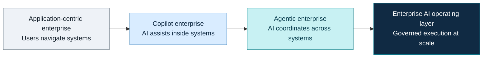
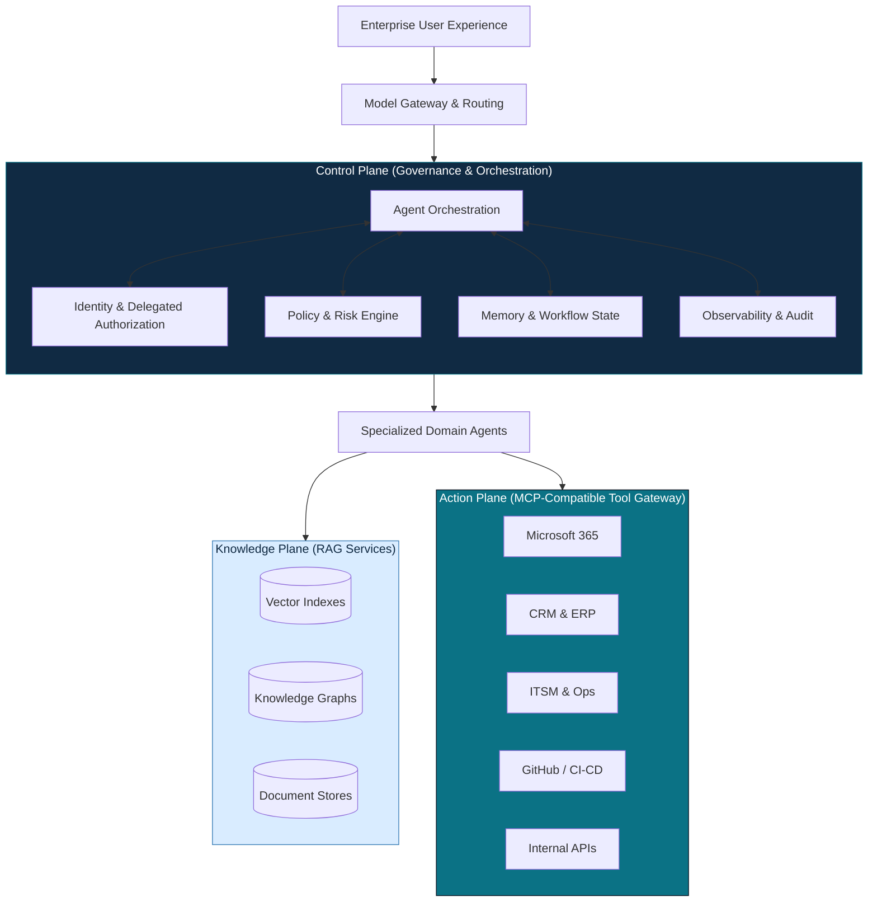
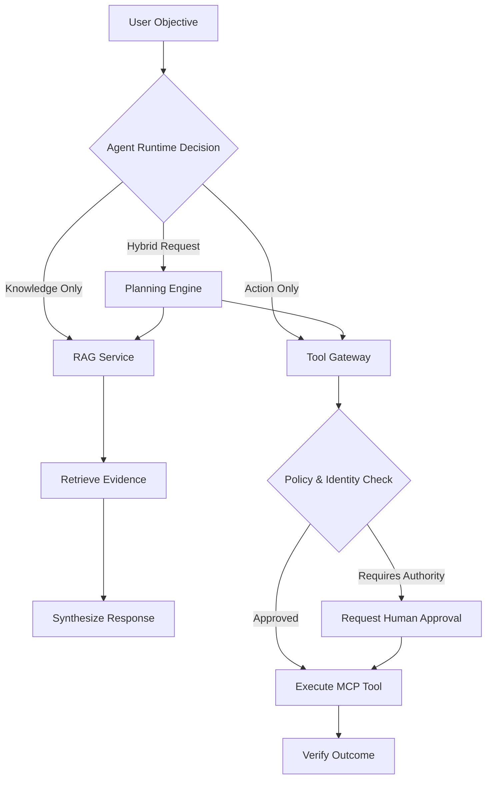
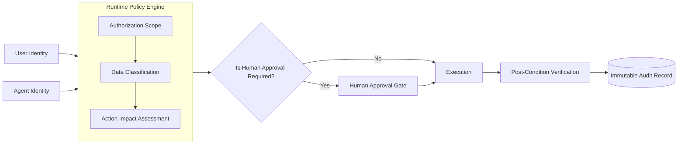
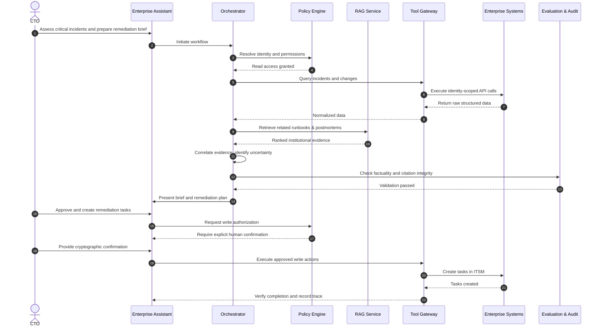
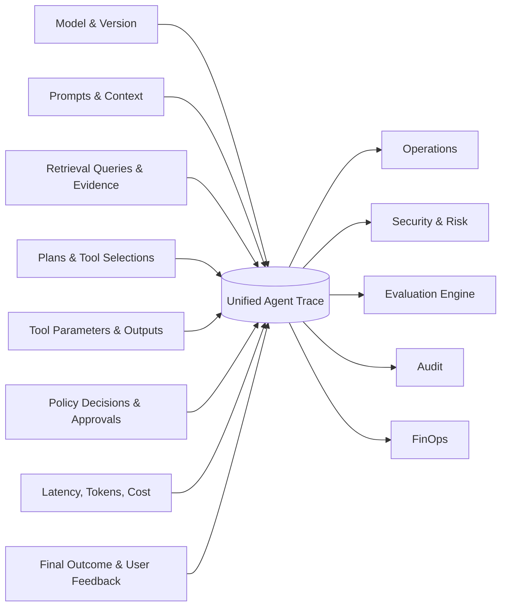
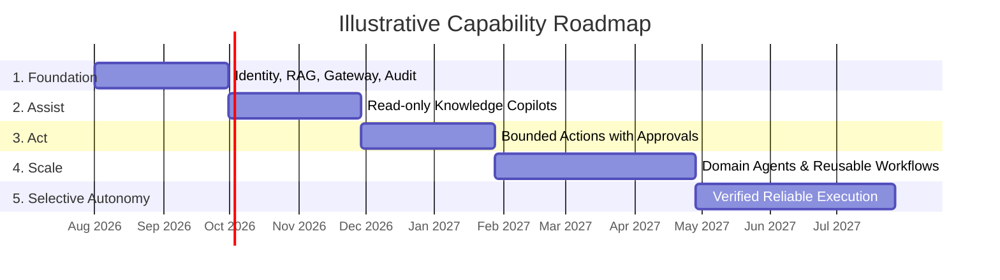

  
CTO Strategic Architecture Brief

  <h1 style="font-size: 2.75rem; font-weight: 700; line-height: 1.2; margin: 0 0 1.5rem 0; color: #ffffff;">Building the Enterprise AI Operating Layer</h1>
  
From isolated copilots to governed agents that can understand objectives, retrieve institutional knowledge, and act safely across enterprise systems.

  

    The next competitive advantage will not come from deploying more chatbots, but from building the control plane through which intelligence, authority, and execution converge.
  

## Table of Contents

| Section | Description |
|---|---|
| [1. Executive Summary and Strategic Shift](#1-executive-summary-and-strategic-shift) | The transition from application assistance to governed enterprise coordination. |
| [2. AI Control Plane Architecture](#2-ai-control-plane-architecture) | The core reference design separating reasoning, authority, knowledge, and execution. |
| [3. Knowledge Gives Context. Tools Create Consequence.](#3-knowledge-gives-context-tools-create-consequence) | Integrating RAG and MCP-compatible interfaces safely. |
| [4. Governance, Security, and Trust](#4-governance-security-and-trust) | Executable policies, trust boundaries, and runtime security controls. |
| [5. End-to-End Workflow Example](#5-end-to-end-workflow-example) | A step-by-step trace of an executive request through the platform. |
| [6. Observability and Evaluation](#6-observability-and-evaluation) | Reconstructing reasoning environments and evaluating entire workflows. |
| [7. Implementation Roadmap](#7-implementation-roadmap) | The five capability maturity phases from foundation to selective autonomy. |
| [8. CTO Decision Framework](#8-cto-decision-framework) | The essential criteria to validate security, authority, and accountability. |

---

## 1. Executive Summary and Strategic Shift

The enterprise is not merely adding AI to existing applications. It is constructing a new coordination layer between people, institutional knowledge, and operational systems. 

Conventional enterprise software forces humans to navigate systems, understand workflows, and coordinate actions manually. An agentic platform reverses this relationship: the employee states an objective, and the system coordinates authorized knowledge and tools around that objective to accomplish it.

This trajectory is visible in the public programs of organizations like JPMorganChase. Following the deployment of its LLM Suite to hundreds of thousands of employees, the firm has actively signaled its direction toward AI-agent research and a personalized Employee Assistant capable of taking action across the firm. The durable asset in such a transformation is the control plane, not the individual chatbot.

> The strategic progression is not from one chatbot to a better chatbot. It is from application assistance to governed enterprise coordination.

The critical architectural shift is from model access to governed execution. The system should optimize for controlled delegation, not unrestricted autonomy.

---

## 2. AI Control Plane Architecture

The architecture separates the platform into distinct operating planes. Agents do not connect directly to unrestricted systems; all access must pass through rigorous identity, policy, and tool controls.

This design enforces the most important architectural separations in an agentic enterprise:
*   **Reasoning from authority:** The model may propose an action. The policy layer determines whether the action may occur.
*   **Retrieval from execution:** Gathering information is structurally isolated from mutating system state.
*   **Agent logic from system integration:** Domain agents share a unified tool gateway rather than building bespoke system connectors.
*   **Models from business workflows:** The model gateway allows replacing or routing models without breaking business logic.
*   **Conversation memory from systems of record:** What an agent remembers in a session does not overwrite the authoritative data in backend systems.
*   **Successful API calls from verified business outcomes:** The platform checks post-conditions, verifying the intended state was actually reached.

---

## 3. Knowledge Gives Context. Tools Create Consequence.

RAG and MCP solve fundamentally different problems. 

Retrieval-Augmented Generation (RAG) retrieves institutional knowledge and evidence. MCP-compatible integrations expose tools and resources through a consistent interface. The agent runtime dynamically decides when each is needed, while identity and policy determine what may be accessed or executed. Observability records the complete chain of evidence and action.

> RAG gives the system institutional memory. MCP-compatible tools give it operational reach. Governance determines whether that reach is safe.

---

## 4. Governance, Security, and Trust

> Governance is not a review process surrounding the agent. Governance is part of the agent runtime.

An enterprise agent must inherit authority; it must never invent it. The runtime must enforce policy at the moment of execution.

A successful API response is insufficient for enterprise trust. The agent must independently verify that the intended operational state was achieved.

**Mandatory Security Controls:**
*   **Explicit trust boundaries:** Strict separation between instructions and retrieved data.
*   **Prompt-injection resistance:** Inputs must be sanitized and treated strictly as data payloads.
*   **Typed tool schemas:** Enforce rigid input validation rather than free-form command execution.
*   **Least-privilege authorization:** Agents operate only within the delegated rights of the authenticated user.
*   **Secret and sensitive-data controls:** Redaction of sensitive information before hitting external model endpoints.
*   **Rate limits and execution timeouts:** Prevent unbounded runaway execution loops.
*   **Human approval for consequential actions:** Hard gates on material, external, or financial actions.
*   **Reversible actions and compensation procedures:** Defined rollback mechanisms for automated errors.
*   **Tamper-evident audit trails:** Cryptographic or immutable logs of all agent reasoning and execution.

---

## 5. End-to-End Workflow Example

Consider an executive request: 
*"Assess yesterday’s critical incidents, identify recurring causes, compare them with recent infrastructure changes, and prepare an executive remediation brief."*

The system delegates this objective through a controlled, step-by-step workflow:

This sequence demonstrates controlled delegation rather than unrestricted autonomy.

---

## 6. Observability and Evaluation

Conventional application monitoring cannot reconstruct an agent workflow. Agent observability must capture the entire lifecycle of decision-making. 

The evaluation target is the complete workflow, not only the language model. 

| Evaluation Dimension | Measurement Focus |
|---|---|
| **Retrieval Quality** | Recall, precision, freshness, and access-control correctness. |
| **Factuality** | Groundedness in evidence, citation integrity, and hallucination rates. |
| **Planning Quality** | Task decomposition logic, redundant steps, and error recovery behavior. |
| **Tool Accuracy** | Correct tool selection, schema-valid arguments, and execution success. |
| **Security** | Injection resistance, data leakage prevention, and privilege boundaries. |
| **Business Outcomes** | Goal completion rate, cycle time reduction, and user acceptance. |
| **Latency and Cost** | Time to first token, total execution time, and token efficiency. |
| **Governance Compliance** | Adherence to approval gates and audit completeness. |

---

## 7. Implementation Roadmap

The deployment of an agentic platform is a maturity progression, optimizing for safety and value at each stage.

*   **Foundation:** Identity propagation, model gateway, RAG infrastructure, tool registry, audit logs, and evaluation pipelines.
*   **Assist:** Read-only knowledge assistants and copilots that summarize and synthesize.
*   **Act:** Bounded actions with mandatory human-in-the-loop approval gates.
*   **Scale:** Deployment of specialized domain agents utilizing shared reusable workflows.
*   **Selective Autonomy:** Full autonomy deployed strictly where reliability, observability, and reversibility have been conclusively demonstrated.

> Autonomy should be earned through evidence, not granted through ambition.

---

## 8. CTO Decision Framework

Before any agent workflow is deployed, it must pass a rigorous architectural approval gate.

| Architectural Requirement | Decision Criteria |
|---|---|
| **Identity** | Is there an authenticated human identity plus an explicit agent identity? |
| **Delegated Authority** | Is the authorization time-bounded, least-privilege, and explicitly delegated? |
| **Data Provenance** | Is there source-level provenance with strict access control checks? |
| **Model Provenance** | Is the model version, configuration, and routing rationale fully logged? |
| **Tool Operations** | Are operations strictly typed, parameters validated, and side-effects recorded? |
| **Post-Condition Verification**| Does the system verify the final state, rather than just accepting a 200 OK? |
| **Reversibility** | Is there a defined compensation or rollback procedure if the action fails? |
| **Escalation** | Does the agent have a clear fallback to escalate, abstain, or ask a human? |
| **Observability** | Can a unified trace reconstruct the exact reasoning and execution chain? |
| **Evaluation** | Is the workflow measured against quantitative business and security KPIs? |
| **Ownership** | Is there a designated business owner and risk owner for the agent's actions? |
| **Incident Response** | Can the agent be instantly killed or its tool access revoked globally? |

> If the organization cannot reconstruct who acted, under whose authority, using which evidence, through which tools, and with what verified outcome, then it does not yet have an enterprise agent platform.

---

  <h3 style="color: #64d2ff; font-size: 1.5rem; margin-top: 0;">The Architecture Thesis</h3>
  

    The winning enterprise design is neither a single chatbot nor a collection of disconnected agents. It is a governed intelligence and execution layer that can understand an objective, retrieve authorized evidence, construct a bounded plan, invoke approved tools, request human authority at the correct boundary, verify the result, and preserve a complete audit trail.
  

> The transition from copilot to operating system begins when AI is no longer confined to answering questions and becomes capable of coordinating enterprise work—without escaping enterprise control.

---

## References

1. [JPMorganChase — LLM Suite named 2025 “Innovation of the Year”](https://www.jpmorganchase.com/about/technology/blog/llmsuite-ab-award)
2. [JPMorganChase — Innovation Week 2025: LLM Suite adoption](https://www.jpmorganchase.com/about/technology/blog/innovation-week25)
3. [JPMorganChase — Artificial Intelligence Research](https://www.jpmorganchase.com/about/technology/research/ai)
4. [JPMorganChase — 2025 Annual Report: Letter from Jennifer A. Piepszak](https://www.jpmorganchase.com/ir/annual-report/2025/ar-ceo-letter-jennifer-piepszak)
5. [JPMorganChase — 2025 Line-of-Business CEO Letters](https://www.jpmorganchase.com/content/dam/jpmc/jpmorgan-chase-and-co/investor-relations/documents/line-of-business-ceo-letters-to-shareholders-2025.pdf)
6. [Anthropic — Model Context Protocol](https://docs.anthropic.com/en/docs/agents-and-tools/mcp)
7. [Microsoft — MCP Server for Enterprise overview](https://learn.microsoft.com/en-us/graph/mcp-server/overview)
8. [Docsify-This — Markdown publishing platform](https://docsify-this.net/)

---

<small>
<strong>Research Note:</strong> Public sources were reviewed through mid-2026. Internal JPMorganChase implementation details are proprietary. Any reference to MCP, RAG topology, vector databases, knowledge graphs, model routing, or specific control-plane components is presented as a proposed enterprise reference architecture—not as a factual description of JPMorganChase’s undisclosed internal stack.
</small>
